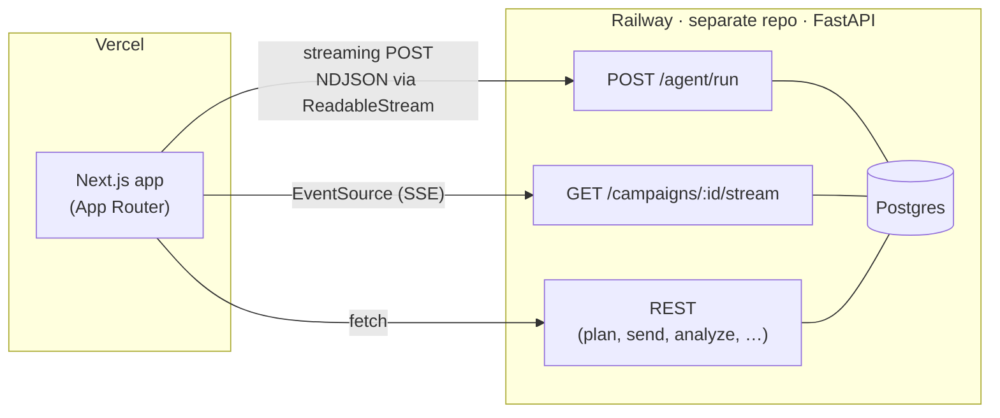

# loop-frontend

The web UI for **Loop**, an autonomous marketing-campaign agent for a D2C coffee chain. It's the marketer-facing chat console for describing and launching campaigns, plus a live tracker that streams each campaign's delivery and engagement in real time.

The backend — CRM + stubbed channel services + Postgres — runs as separate FastAPI services and lives in [its own repo](#links).

## Architecture (client's view)



- **Planner timeline** — `runAgent()` issues a streaming `POST /agent/run` and reads the response body as a `ReadableStream`, parsing newline-delimited JSON line by line to render the agent's reasoning as it happens. (A POST body rules out `EventSource`, hence the manual reader.)
- **Live tracker** — `openCampaignStream()` opens a native `EventSource` **directly** to the CRM's `GET /campaigns/{id}/stream` (SSE) for delivery/engagement updates.

The browser talks to the CRM directly; there is no Next.js API/proxy layer.

## Stack

- **Next.js 16** (App Router) · **TypeScript**
- **Tailwind CSS v4** for the design system + tokens
- **framer-motion** for the orchestrated motion (live timeline, count-ups, transitions)

## Key screens

- **Planner** (`/`) — chat box → streamed reasoning timeline → a **plan card** with confidence ring, included/excluded explainability, the compiled SQL, projected performance, and a **per-customer drill-down** (click a sampled customer to ask the agent why they're in the segment).
- **Live tracker** (`/campaigns/[id]`) — SSE-driven funnel tiles and a breathing message stream, the **mid-campaign switch banner** (the agent proposes a channel change you approve inline), and the **post-campaign analyze card** (attributed revenue, final rates, what worked / what didn't / next step).
- **Past Campaigns** (`/campaigns`) — a grid of every campaign run, each card showing channel, funnel, rates, and attributed revenue; click through to its tracker.

## Local setup

The frontend needs the **backend services running locally** (CRM + channel services) for the full flow.

```bash
npm install
# create .env.local (see below)
npm run dev          # http://localhost:3000
```

## Environment variables

| Variable | Description |
| --- | --- |
| `NEXT_PUBLIC_API_URL` | Base URL of the CRM service. The Railway CRM URL in production; `http://localhost:8000` in dev. |

`.env.local`:

```bash
NEXT_PUBLIC_API_URL=http://localhost:8000
```

> ⚠️ `NEXT_PUBLIC_*` values are **baked in at build time**. Changing `NEXT_PUBLIC_API_URL` requires a rebuild/redeploy (and a fresh `next dev` locally) — editing the env without restarting won't take effect.

## Links

- **Live app:** `https://loop-frontend-nine.vercel.app/` 
- **Backend repo:** `https://github.com/Parth4950/loop-backend` 
- **Design notes:** [`TRADEOFFS.md`](https://github.com/Parth4950/loop-backend/blob/main/TRADEOFFS.md) and [`AI_WORKFLOW.md`](https://github.com/Parth4950/loop-backend/blob/main/AI_WORKFLOW.md) — both live in the backend repo.
